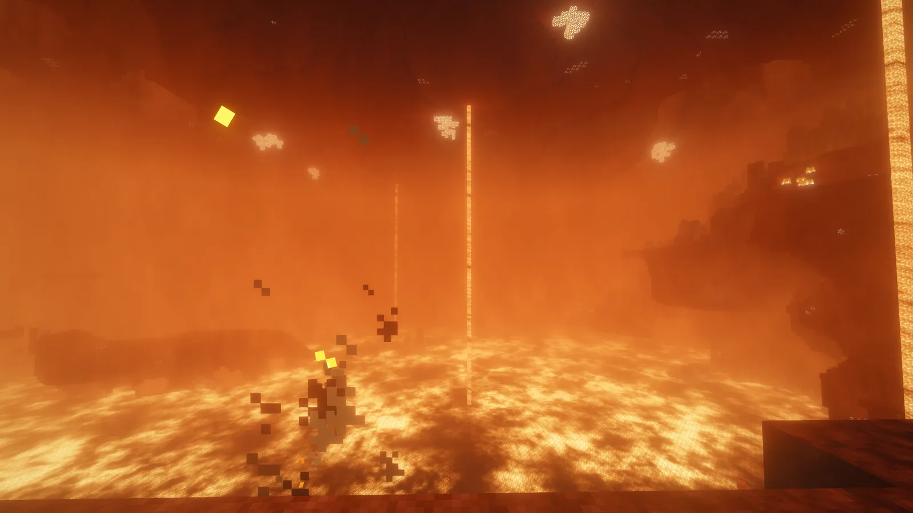
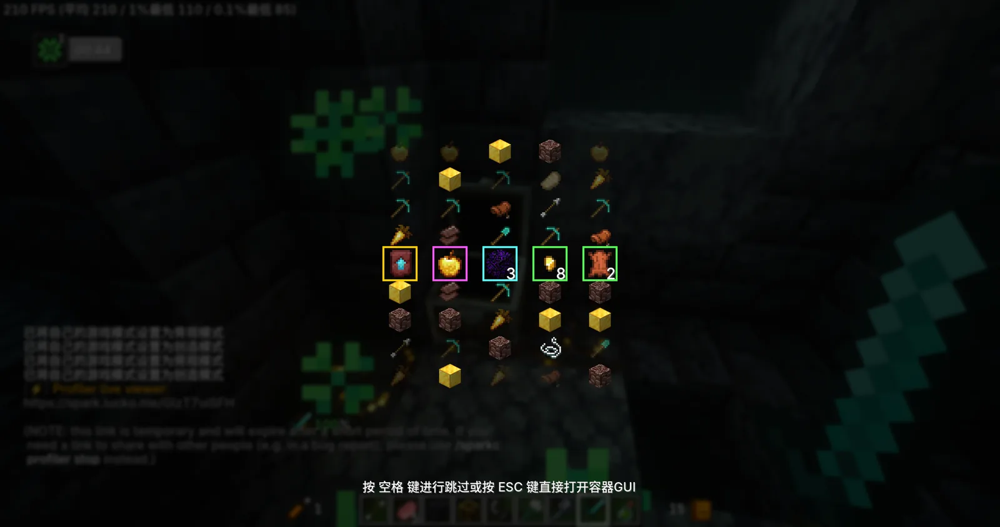

# Seki

> 从灶台出发，去往更远的地方。

> [!IMPORTANT]
> Seki 当前处于**开发中可试玩**阶段。公开发布包尚未开放，本仓库本身也不是可直接启动的完整游戏实例。

## Seki 是什么

Seki 是由 ProjectNautic 制作的 Minecraft 1.21.1 NeoForge 生活冒险整合包。它围绕料理、探索与战利品重新组织生存节奏：离开住处寻找食材与资源，回到厨房完成真正的加工和烹饪，再带着收获走向更远的地方。

这里没有强制规定单一玩法。你可以独自整理菜谱、建设厨房和酒馆，也可以与朋友共享聚落、分头探索；多人世界中的自然战利品会为每位玩家独立生成，不必争抢同一个宝箱。

## 核心游玩循环

1. **探索寻材**：在主世界及主题扩展内容中寻找食材、酿造原料与战利品。
2. **料理准备**：使用炒锅、汤锅、石磨和酒桶完成烹饪与酿造，而不是把所有食物压缩成工作台合成。
3. **继续远征**：带回新的材料和收藏，扩建厨房与住处，然后为下一次出发做好准备。

## 主要特色

- **有过程的料理系统**：森罗物语：厨房提供炒锅、汤锅与石磨等料理设备。炒菜需要实际处理，盖饭在烹饪完成后使用熟米饭盛取；KubeJS 负责统一存在冲突的获取路径。
- **熟悉而丰富的菜肴**：国味扩展带来中式炒菜与盖饭，酒馆扩展则加入酒桶酿造和一系列餐饮主题装饰。料理不只用于填满饥饿值，也构成聚落生活的一部分。
- **适合共同探索的战利品**：Lootr 让同一个自然战利品容器为每位玩家提供独立奖励，兼顾单人与多人世界的探索价值。
- **看得见的奖励反馈**：物品稀有度、开箱转盘与地面战利品光束共同强化发现珍贵物品时的反馈，同时保留可继续调校的空间。
- **统一的视听体验**：默认启用 Complementary Unbound + Euphoria Patches 光影，并搭配环境声景、粒子、界面动画和社区中文资源。
- **完整的便利与性能底座**：JEI、Jade、Xaero 地图等工具负责信息查询；渲染、逻辑、区块、内存、网络与实体剔除等优化共同支撑当前规模。

## 当前版本与运行要求

| 项目 | 当前基线 |
| --- | --- |
| 整合包版本 | `2026.07.28` |
| Minecraft | `1.21.1` |
| 模组加载器 | `NeoForge 21.1.235` |
| Java | 64 位 Java 21 |
| 当前模组数量 | 124 |
| 客户端内存建议 | 6–8 GB |
| 游玩方式 | 单人 / 多人 |
| 开发状态 | 开发中可试玩 |

默认光影对显卡性能有额外要求。低配设备遇到帧率问题时，建议先关闭光影并降低阴影距离；内存也不应在没有需要时无限增加。

## 获取与安装

**[GitHub Releases（即将开放）](https://github.com/Aero-Seira/Seki/releases)**

公开发布后，这里会提供完整整合包与启动器导入说明。目前请不要把仓库源码压缩包当作游戏实例：仓库主要保存配置、脚本、设计资料和版本清单，第三方模组 JAR 不随源码仓库分发。

## 开发状态与已知限制

- 料理配方仍在持续统一，部分盖饭路径完成了静态验证，但仍需更多运行时回归。
- 下界与末地主题扩展已经加入；它们的完整内容范围及世界生成影响仍在盘点。
- 独立战利品的多人回归、高掉落密度下的视觉性能，以及低配设备的默认光影表现仍待系统测试。
- 公开发布包、启动器导入流程和更新机制尚未完成。

开发版本可能调整配方、配置或模组组合。使用现有实例游玩时，请在更新前备份重要世界。

## 项目资料

- [设计文档总览](docs/design/README.md)：产品定义、组件地图与跨系统约束
- [设计变更记录](docs/design/change-log.md)：每批内容调整及其验证状态
- [料理配方统一宪章](design/charter.md)：当前料理工序与盖饭路径规则
- [当前内容清单](docs/design/_generated/current-inventory.md)：由本地扫描生成的模组与配置证据
- [问题反馈](https://github.com/Aero-Seira/Seki/issues)：报告崩溃、兼容问题或体验建议

如需参与开发，请先阅读 [AGENT.MD](AGENT.MD) 中的兼容性、验证与文档维护约定。

## 致谢

感谢所有模组、资源包、光影与工具作者，让 Seki 得以建立在成熟的 Minecraft 社区生态之上；也感谢持续提供测试、反馈与翻译的玩家。

Minecraft 属于 Mojang Studios。各模组、资源包与光影的著作权及许可归其各自作者所有。
